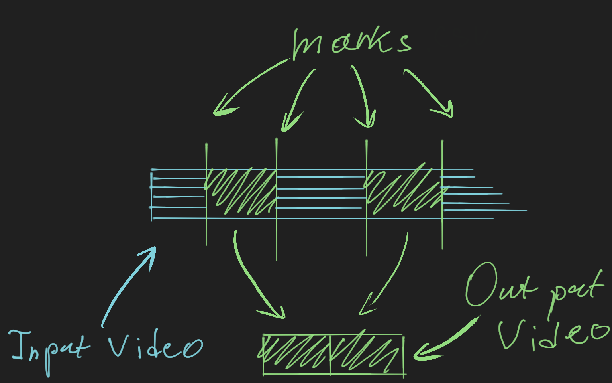

# Markut

Given the [VOD](https://help.twitch.tv/s/article/video-on-demand) of the stream and the timestamps file, generate a video using [ffmpeg](https://www.ffmpeg.org/) that cuts out part of the VOD according to the provided markers.



## Quick Start

Install [Go](https://golang.org/) and [ffmpeg](https://www.ffmpeg.org/).

```console
$ go build
$ ./markut final -markut marks.markut -input vod.mp4 -delay 4
```

## Example of a Markut file

```c
// You can use C-style comments
/* Inline comments work too if you're into that */

// Markut file consists of a sequence of timestamps.

23           // A single number is seconds.
             // This is 23 seconds.

23.69        // Seconds may have fractional part.
             // This is 23 seconds and 690 milliseconds.

45  50       // Timestamps don't have to be on the same line.
             // Useful when you want to visually denote a range.

69           // This is 1 minute and 9 seconds.
1:09         // This is also 1 minute and 9 seconds.
24:45:09     // 24 hours, 45 minutes and 9 seconds.
24:45:09.69  // 24 hours, 45 minutes, 9 seconds and 690 milliseconds.
```
